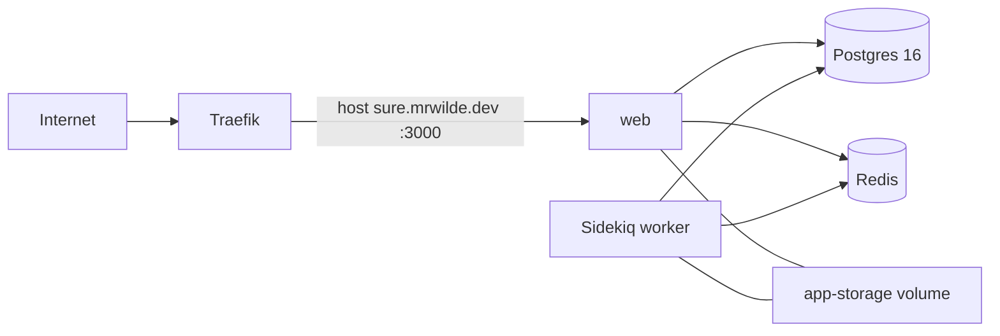

# Deploy Sure Finance on Dokploy

## Problem

Get Sure (Maybe fork) running on the home Dokploy host, reachable on a `*.mrwilde.dev` domain like the other self-hosted
apps (PasswordPusher, Hindsight).

## Current state

- **App:** Rails personal-finance app. The official self-host path is Docker Compose (`docs/hosting/docker.md`,
  `compose.example.yml`).
- **Stack required:** `web` + `worker` (Sidekiq) + Postgres 16 + Redis. Shared volume for Active Storage
  (`app-storage`).
- **Image:** `ghcr.io/robwilde/sure-finance:sha-<40hex>` — built from fork `main` by `.github/workflows/publish.yml`,
  pinned into the compose file per deploy by `.github/workflows/deploy-dokploy.yml`. See "CI deploy".
- **Dokploy:** Reachable at `https://dokploy.mrwilde.dev/api` (publicly, valid TLS). Auth header is `x-api-key` (Bearer
  returns 401).
- **API key location (local):** `DOKPLOY_URL` / `DOKPLOY_API_KEY` in `~/.claude.json` under the dokploy-mcp env block.
  Also stored as the `DOKPLOY_API_KEY` secret on `robwilde/sure-finance`. Do not commit secrets.
- **MCP gap:** The published Dokploy MCP tool list covers projects, applications, domains, Postgres, MySQL only.
  **Compose and Redis exist on the real API** (`compose.create`, `compose.update`, `compose.deploy`, `compose.delete`,
  `redis.create`, `redis.deploy`, …) but are not in the MCP tool docs. Prefer raw HTTP to the Dokploy API (or extend MCP
  later) for this deploy.
- **Domain pattern in use:** `*.mrwilde.dev` with Let's Encrypt via Traefik (e.g. `secrets.mrwilde.dev`,
  `hindsight.mrwilde.dev`). Dokploy can also suggest `*.sslip.io` (`domain.generateDomain`) if DNS is not ready.

## Recommended architecture

Use **one Dokploy Compose service** (not four separate Applications). Sure's upstream compose already wires service DNS
(`db`, `redis`), health checks, and the shared storage volume. Splitting into discrete Dokploy apps forces manual
internal networking and is easy to get wrong.



**Why not the MCP-only path?** MCP can create Postgres + Application, but not Redis or a multi-container compose file. A
single GHCR image still needs Redis for Sidekiq/imports.

## Target config (fill before execute)

| Setting              | Suggested default                | Notes                                                    |
|----------------------|----------------------------------|----------------------------------------------------------|
| Project name         | `Sure Finance`                   | New Dokploy project                                      |
| Environment          | `production` (auto-created)      | Record `environmentId`                                   |
| Compose service name | `sure`                           | Dokploy compose resource                                 |
| Public host          | `sure.mrwilde.dev`               | Confirm DNS A/AAAA → Dokploy server public IP            |
| `APP_DOMAIN`         | `sure.mrwilde.dev`               | **Required.** Mailer host + WebAuthn RP-ID fallback      |
| Image tag            | `ghcr.io/robwilde/sure-finance:sha-<40hex>` | Immutable per deploy; see "CI deploy"     |
| Container port       | `3000`                           | Domain → service `web`, port 3000                        |
| SSL                  | Let's Encrypt + HTTPS            | Leave both SSL env vars unset; defaults are correct      |

## Compose file to load into Dokploy

Live file: `.dokploy/stack.yml` (repo root), uploaded to Dokploy on every deploy with `__IMAGE__` substituted. It was
adapted from `compose.example.yml`; important deltas for Dokploy/Traefik:

- Do **not** publish host ports on `web` (Traefik routes internally). If Dokploy requires a port on the domain object,
  set domain port `3000` and `serviceName: web`.
- Leave `RAILS_ASSUME_SSL` and `RAILS_FORCE_SSL` **unset**. Both default to `true`
  (`config/environments/production.rb:45,49`) and are designed to pair — `assume_ssl` is precisely what makes
  `force_ssl` safe behind a TLS-terminating proxy. Copying upstream's `RAILS_FORCE_SSL: "false"` drops HSTS and the
  `Secure` flag on the session cookie. The redirect loop people fear comes from `force_ssl=true` + `assume_ssl=false`,
  which is not this setup.
- Put secrets in Dokploy compose **env** (Dokploy injects them); avoid baking passwords into the compose YAML when
  possible.
- **Override `SECRET_KEY_BASE`.** `compose.example.yml:52` ships a hardcoded fallback published in a public repo.
  Booting on it also makes the derived encryption keys public — see "Secrets and encryption" below.
- Keep `db` / `redis` internal only (no external ports).
- **Enable the `backup` profile at bring-up**, not later. This is a finance app and it costs one flag.
- Use Docker **named volumes** for `app-storage`, `postgres-data` and `redis-data`, not bind mounts under
  `/opt/sure-data/`. There is no working SSH to the Dokploy host, so a bind mount cannot be `chown`ed to the image's uid
  1000 (`rails`), and Postgres/Rails would fail to write. Named volumes inherit correct ownership from the image.
  Consequence: never delete the Dokploy compose resource (that orphans the volumes) — update it in place. Durability is
  covered by the nightly `backup` dumps, which bind-mount `/opt/sure-data/backups` (root-owned, backup container runs as
  root).
- The `backup` service ships behind `profiles: [backup]` upstream; **strip that key**. Dokploy runs plain
  `docker compose up -d`, which skips profiled services.

Minimal service set:

1. `web` — pinned image, env from rails block, volume `app-storage`, depends_on healthy db+redis, DNS 8.8.8.8/1.1.1.1 if
   Yahoo/provider IPv6 issues appear. **Add a health check** — upstream defines none for `web`, and `GET /up` exists
   (`config/routes.rb:815`), so Traefik will otherwise route to a still-booting container.
2. `worker` — same image, `command: bundle exec sidekiq`, same env + volume. It does **not** migrate:
   `bin/docker-entrypoint:14-16` runs `db:prepare` only when argv is `./bin/rails server`, so on deploy the worker can
   briefly boot against a pre-migration schema.
3. `db` — `postgres:16`, volume `postgres-data`, healthcheck `pg_isready`.
4. `redis` — pin a major tag (e.g. `redis:7`) rather than upstream's `redis:latest`; volume `redis-data`, healthcheck
   `redis-cli ping`. Never set `maxmemory-policy allkeys-lru`: `production.rb:73` points the Rails cache at the same
   `REDIS_URL` and database as Sidekiq, so eviction would drop job queues.

Shared rails env (names match upstream):

- `SELF_HOSTED=true`
- `SECRET_KEY_BASE` — generate: `openssl rand -hex 64`. **Never rotate after first use** (see below).
- `APP_DOMAIN=sure.mrwilde.dev` — required. Sets the mailer URL host (`production.rb:78`) and is the WebAuthn RP-ID
  fallback (`config/initializers/webauthn.rb:10`). Without it `rp_id` resolves to `localhost` in production and passkey
  registration fails with an RP-ID mismatch.
- `POSTGRES_USER` / `POSTGRES_PASSWORD` / `POSTGRES_DB` (e.g. `sure_user` / strong password / `sure_production`)
- `DB_HOST=db` `DB_PORT=5432`
- `REDIS_URL=redis://redis:6379/1`
- `ACTIVE_RECORD_ENCRYPTION_PRIMARY_KEY` / `_DETERMINISTIC_KEY` / `_KEY_DERIVATION_SALT` — set all three explicitly via
  `bin/rails db:encryption:init`. See below.
- SMTP: `SMTP_ADDRESS` / `SMTP_PORT` / `SMTP_USERNAME` / `SMTP_PASSWORD` / `EMAIL_SENDER`. Not required to register, but
  password reset and invitations are dead without it — see "Mail and lockout".
- `ONBOARDING_STATE` — defaults to `open` (`app/models/setting.rb:170-173`). Leave open for first registration, then
  close it (step 7).
- Optional later: OpenAI, Redbark, Plaid, `WEBAUTHN_ALLOWED_ORIGINS`

### Secrets and encryption (read before generating anything)

`config/initializers/active_record_encryption.rb:23-37` — when `SELF_HOSTED=true` and no explicit encryption keys are
set, all three Active Record encryption keys are derived from `SECRET_KEY_BASE`:

```ruby
primary_key = Digest::SHA256.hexdigest("#{secret_base}:primary_key")[0..63]
```

Consequences:

- **Rotating `SECRET_KEY_BASE` after any provider is connected permanently orphans every encrypted column** — provider
  access tokens, `Setting` API keys, MFA secrets. There is no recovery path.
- Booting on the `compose.example.yml:52` default means the encryption keys are derivable from a public repo.

Set `ACTIVE_RECORD_ENCRYPTION_*` explicitly up front to decouple the two, generate `SECRET_KEY_BASE` once into the
Dokploy env, and treat it as immutable thereafter.

### Mail and lockout

`require_email_confirmation` gates only *email change* (`app/models/user.rb:104`), not registration — first signup works
without SMTP. Password reset and invitations do not. On a single-super-admin instance with no mail, a forgotten password
is recoverable only by shelling into the container:

```bash
docker exec -it <sure-web-container> ./bin/rails console
```

## Execution steps (API)

Use `x-api-key: $DOKPLOY_API_KEY` and base URL `https://dokploy.mrwilde.dev/api`.

1. **DNS**
  - Create `sure.mrwilde.dev` (or chosen host) A record → Dokploy host public IP.
  - Optionally validate with `domain.validateDomain`.

2. **Create project**
  - `POST project.create` `{ "name": "Sure Finance", "description": "Self-hosted Sure personal finance" }`
  - Save `projectId` and nested default `environment.environmentId`.

3. **Create compose service**
  - `POST compose.create` `{ "name": "sure", "environmentId": "<envId>" }`
  - Save `composeId` / `appName`.

4. **Upload compose + env**
  - `POST compose.update` with `composeId`, full `composeFile` string (docker-compose YAML), and `env` as newline
    `KEY=value` string for secrets Dokploy should inject.
  - Confirm fields against a dry `compose.one?composeId=` after update (GET query style; many `.one` routes are
    GET+query, not POST body).
  - Set `sourceType` / raw file as needed so Dokploy uses the inline `composeFile` (create defaulted `sourceType` to
    github with null repo — update so deploy does not try to clone).

5. **Domain**
  - `POST domain.create` with `host`, `https: true`, `certificateType: "letsencrypt"`, `stripPath: false`,
    `domainType: "compose"`, `composeId`, `serviceName: "web"`, `port: 3000`.
  - Match patterns used on Hindsight/PasswordPusher for HTTPS apps on this host.

6. **Deploy**
  - `POST compose.deploy` `{ "composeId": "..." }`
  - Poll `compose.one` until `composeStatus` is healthy/done (not `error`/`idle` stuck).
  - Watch Dokploy UI logs if pull/migrate fails.

7. **Smoke test**
  - `https://sure.mrwilde.dev` → login/register page.
  - First user becomes super admin; then set onboarding to **Closed** or **Invite-only** under Settings → Self-Hosting.
  - Confirm migrations ran: `/up` returns 200 and Settings pages render.
  - Confirm the worker is **processing**, not merely running — trigger a sync and watch it reach `completed`. Sidekiq UI
    is `/sidekiq`, super admin only.
  - Confirm `app-storage` survives a redeploy: upload an avatar, redeploy the stack, reload.
  - Register a passkey. An RP-ID error here means `APP_DOMAIN` is unset.

8. **Hardening (same session or follow-up)**
  - Rotate the DB password or provider API keys if they leaked into shell history. **Do not rotate `SECRET_KEY_BASE`** —
    see "Secrets and encryption". If it genuinely leaked, rotating means re-entering every encrypted secret by hand, or
    restoring from backup.
  - Store `SECRET_KEY_BASE`, the `ACTIVE_RECORD_ENCRYPTION_*` triple, and the DB password in a password manager; Dokploy
    env is source of truth on the server.
  - Decide image pin (`:stable` vs digest).
  - Confirm the `backup` profile is running and a dump actually landed in `/opt/sure-data/backups`.
  - Optional providers (Redbark for AU banks — `docs/hosting/redbark.md`) only after base app is stable.

## Alternate architecture (if compose API misbehaves)

Four Dokploy resources in one project:

1. `postgres.create` + `postgres.deploy` (Postgres 16 image if selectable).
2. `redis.create` + `redis.deploy` (API requires `name`, `databasePassword`, `environmentId`).
3. Application `sure-web` — `sourceType: docker`, image `ghcr.io/we-promise/sure:stable`, mount volume →
   `/rails/storage`, env pointing `DB_HOST`/`REDIS_URL` at Dokploy internal service hostnames (`appName` values from
   postgres/redis).
4. Application `sure-worker` — same image, command `bundle exec sidekiq`, same env + mount, **no** public domain.

Domain only on `sure-web`, port 3000. This matches how Hindsight pairs `application` + `postgres`, extended with Redis +
worker. More moving parts; use only if compose deploy is blocked.

## API quirks learned on this host

- Auth: **`x-api-key` only**.
- `project.all` returns nested `environments[]` with `applications`, `postgres`, `redis`, `compose`, etc.
- `project.one` / `application.one` / `compose.one`: prefer **GET with query string** (`?projectId=` /
  `?applicationId=` / `?composeId=`). POST body often 404.
- `server.all` returned `[]` here — apps run on the Dokploy host itself (`serverId: null` is normal).
- Creating resources without cleanup leaves junk; always delete failed probes (`project.remove`, `compose.delete`,
  `domain.delete`).
- Dokploy MCP package docs are incomplete vs this server's API surface; do not treat MCP tool list as the full API.

## Verified against the codebase (2026-08-13, v0.7.4-alpha.4)

| Claim                                                 | Evidence                                                |
|-------------------------------------------------------|----------------------------------------------------------|
| First user becomes super admin                        | `app/models/user.rb:76-79`                              |
| `:stable` = last non-alpha; `:latest` = alpha channel | `.github/workflows/publish.yml:101-107`                 |
| `force_ssl` / `assume_ssl` both default `true`        | `config/environments/production.rb:45-49`               |
| Encryption keys derived from `SECRET_KEY_BASE`        | `config/initializers/active_record_encryption.rb:23-37` |
| `APP_DOMAIN` sets the mailer URL host                 | `config/environments/production.rb:78`                  |
| `APP_DOMAIN` is the WebAuthn RP-ID fallback           | `config/initializers/webauthn.rb:10-13`                 |
| `ONBOARDING_STATE` defaults to `open`                 | `app/models/setting.rb:170-173`                         |
| Email confirmation gates email *change*, not signup   | `app/models/user.rb:104`                                |
| Only `web` runs `db:prepare`; `worker` does not       | `bin/docker-entrypoint:14-16`                           |
| Rails cache shares `REDIS_URL` and DB with Sidekiq    | `config/environments/production.rb:73`                  |
| Health endpoint                                       | `config/routes.rb:815`                                  |
| `SECRET_KEY_BASE` has a public hardcoded fallback     | `compose.example.yml:52`                                |

## CI deploy

Auto-deploy runs on every green push to fork `main`; no manual step.

```
push main
  → publish.yml   (CI, then native amd64+arm64 build, ~11 min observed)
                  pushes ghcr.io/robwilde/sure-finance:sha-<40hex>
  → deploy-dokploy.yml  (workflow_run: "Publish Docker image" success, push events only)
      render .dokploy/stack.yml  (__IMAGE__ → …:sha-<sha>)
      POST compose.update          (composeFile only; Dokploy keeps the env block)
      POST compose.deploy
      poll deployment.allByCompose for the NEW deployment row → done
      assert the running web container's image id == the built manifest's config digest
      curl https://sure.mrwilde.dev/up
```

`publish.yml` is deliberately unmodified (keeps upstream merges clean); the nightly `schedule` build tags `nightly`, not
`sha-*`, and the `github.event.workflow_run.event == 'push'` guard stops it deploying.

### Why the image tag is immutable per deploy

Dokploy's compose deploy runs exactly `docker compose -p <appName> -f docker-compose.yml up -d --build --remove-orphans`
(`packages/server/src/utils/builders/compose.ts:102` in Dokploy v0.29.14) — **no `pull`, no `--force-recreate`, no
`down`**. For an `image:`-only service that means Compose consults the local image store, finds the tag already present
at its old digest, sees an unchanged service config hash, and leaves the container running. A floating tag therefore
deploys **nothing** while still reporting success. Observed here: moving `:prod` to a new build left `web` running the
previous image (container image id unchanged, uptime unbroken) after a `done` deployment.

So the stack definition lives in `.dokploy/stack.yml` with an `__IMAGE__` placeholder, and each deploy uploads a
compose file pinned to `sha-<deployed sha>`. The changed image reference is what makes Compose pull and recreate — and
only `web`/`worker` are recreated; `db`, `redis` and `backup` keep running. The repo file is the source of truth for the
stack; Dokploy holds only the env block (secrets). Editing the compose file in the Dokploy UI is pointless — the next
deploy overwrites it.

The other trap in the same area: `composeStatus` is written **asynchronously** by Dokploy's in-process queue worker
(`apps/dokploy/server/queues/deployments-queue.ts:36-39`), and stays at the previous terminal value until then. Polling
`compose.one` for `composeStatus == "done"` right after `compose.deploy` can therefore pass instantly on the *previous*
deployment's status. The workflow polls `deployment.allByCompose` for a deployment row that did not exist before the
POST.

Repo config on `robwilde/sure-finance`:

| Name | Kind | Value |
|------|------|-------|
| `DOKPLOY_API_KEY` | secret | Dokploy API key |
| `DOKPLOY_URL` | variable | `https://dokploy.mrwilde.dev/api` |
| `DOKPLOY_COMPOSE_ID` | variable | `WLulD4FY056MI-9H2hjbZ` |
| `DOKPLOY_APP_NAME` | variable | `compose-generate-wireless-panel-nunh1v` |

Manual deploy / rollback — the workflow takes an optional `sha` input and deploys `sha-<that sha>`:

```bash
gh workflow run deploy-dokploy.yml -R robwilde/sure-finance -f sha=<40hex>
```

Any commit whose `publish.yml` run pushed an image is a valid rollback target; no local Docker needed.

### Recorded deployment (2026-08-13)

| Field | Value |
|-------|-------|
| `projectId` | `w3fHymDfQaeXxsqMCJcxC` |
| `environmentId` | `ABiFocDfsyrDZppQurz7f` (`production`) |
| `composeId` | `WLulD4FY056MI-9H2hjbZ` |
| `appName` | `compose-generate-wireless-panel-nunh1v` |
| `domainId` | `JbWQwkyx6QIO3oME0xWea` (`sure.mrwilde.dev`) |
| `sourceType` | `raw` (inline `composeFile`, rewritten per deploy) |

Secrets (`SECRET_KEY_BASE`, `POSTGRES_PASSWORD`, the `ACTIVE_RECORD_ENCRYPTION_*` triple) live only in the Dokploy
compose env and the password manager.

Bring-up evidence (2026-08-13): `Publish Docker image` green in 11m25s → `Deploy to Dokploy` green; all five containers
up (`web`, `db`, `redis` healthy, `worker` and `backup` running — the stripped `profiles` key is what makes `backup`
start); `https://sure.mrwilde.dev/up` → 200 behind a Let's Encrypt cert. GHCR published
`ghcr.io/robwilde/sure-finance` **public** automatically (public source repo), so no visibility flip or registry
credential was needed. The pinned-tag deploy was then verified by hand: `compose.update` + `compose.deploy` recreated
only `web`/`worker`, and the running container's image id matched the `sha-<sha>` manifest's config digest.

## Out of scope for first bring-up

- AI compose (`compose.example.ai.yml`, Pipelock, Ollama)
- Bank providers (Redbark/Plaid/SimpleFIN)
- Custom build from this git checkout (use GHCR image unless you need local patches)

## Success criteria

- Dokploy project **Sure Finance** exists with a deployed compose stack (or equivalent four-service setup).
- HTTPS domain serves the Sure login UI, and the session cookie carries `Secure` (i.e. `force_ssl` is on).
- First account registers and becomes super admin; DB and Redis stay up across restart.
- Migrations applied — `/up` green and Settings renders.
- Sidekiq **processed** a job end to end, not merely booted.
- An Active Storage upload survives a stack redeploy.
- `ACTIVE_RECORD_ENCRYPTION_*` set explicitly; `SECRET_KEY_BASE` overridden from the compose default and recorded as
  immutable.
- A backup file exists in `/opt/sure-data/backups`.
- Secrets are not committed to the sure-finance git repo.
